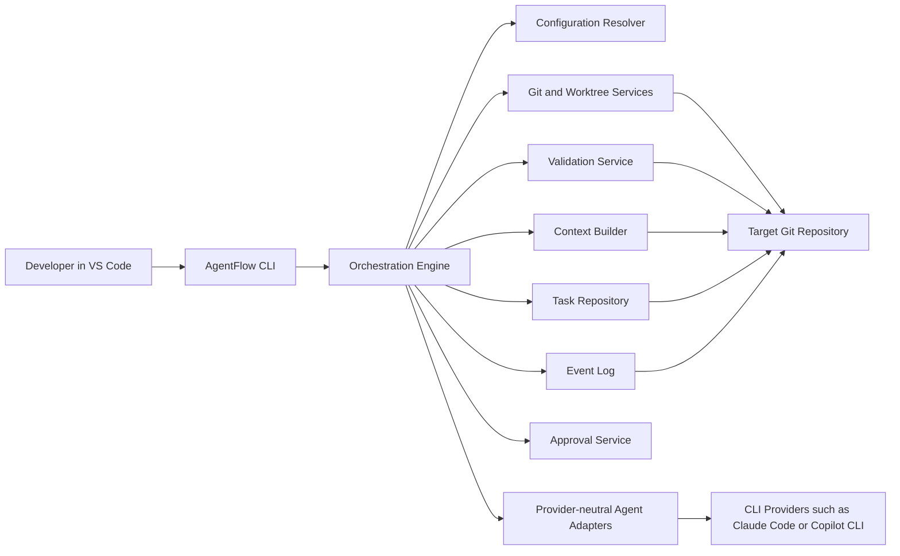
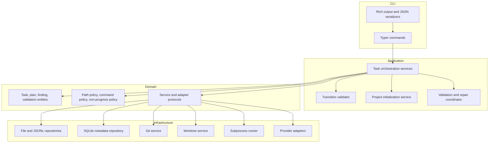
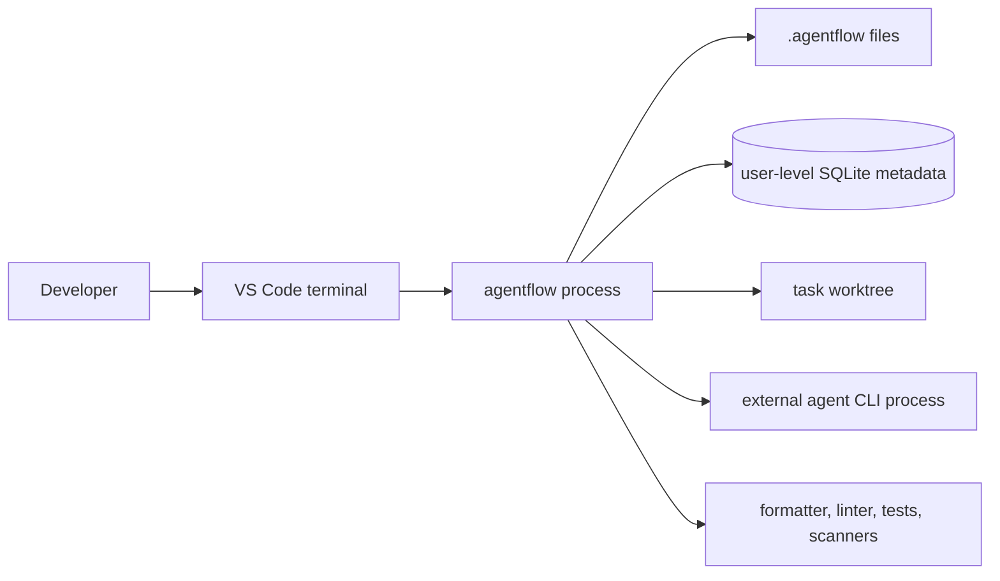

# Architecture

## Overview

AgentFlow is split into a product layer, a repository integration layer, and task-local execution records. The product layer is installed once. The repository integration layer is written into each target repository by `agentflow init`. Task state lives under `.agentflow/tasks/<task-id>` and is updated only by the orchestrator.

## System context

## Component model

## Runtime view

## Module boundaries

- `agentflow.cli`: commands, argument parsing, presentation, exit codes.
- `agentflow.application`: use cases, orchestration coordination, state transition checks.
- `agentflow.domain`: core entities, enums, schemas, policies.
- `agentflow.adapters`: provider-facing agent adapters and safe wrappers.
- `agentflow.infrastructure`: file I/O, SQLite, Git, worktrees, subprocess execution.
- `agentflow.configuration`: defaults, load/merge rules, provenance tracking.
- `agentflow.validation`: validator definitions, pipeline execution, result parsing.
- `agentflow.templates`: built-in prompt templates and project-init templates.

## Dependency rules

- CLI depends on application and presentation helpers only.
- Application depends on domain contracts, never directly on subprocess or provider details.
- Infrastructure depends on domain and application contracts.
- Domain depends on no infrastructure modules.
- Templates are data, not orchestration logic.

## Core entities

- `TaskDefinition`: canonical task metadata and acceptance criteria.
- `TaskStateSnapshot`: current workflow state and permitted actions.
- `TaskEvent`: immutable event record.
- `ApprovalRequest`: pending or resolved human gate.
- `AgentRequest` and `AgentResult`: provider-neutral execution contract.
- `ValidationResult`: deterministic evidence.
- `Finding`: stable reviewer finding with iteration history.
- `ResolvedConfig`: effective config plus origin data.

## Aggregate boundaries

- Task aggregate: requirements, acceptance criteria, plan reference, current state, approvals, findings index.
- Project aggregate: repository-local config, validation profile, prompt overrides, path policy.
- Run aggregate: one agent or validator execution with logs and metadata.

## Key decisions

- The state machine is owned by the orchestrator, not adapters.
- Git worktrees are the isolation boundary for implementation.
- Files are the primary source of project-local truth, with SQLite used for indexes and analytics.
- Validation evidence is produced before reviewer analysis.
- The future VS Code extension is a view layer over stable CLI and artifact contracts.
