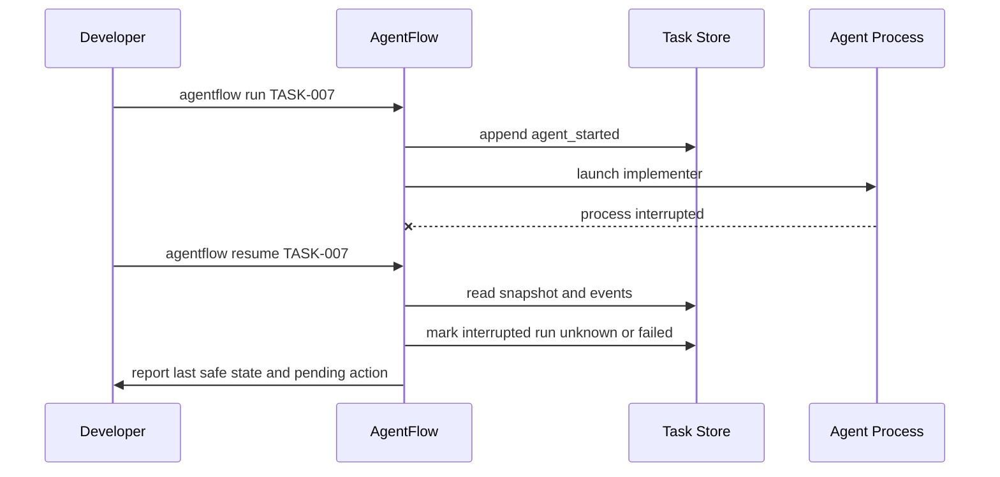

# Failure And Recovery

## Failure classes

- provider failures
- malformed agent output
- command policy violations
- path policy violations
- validation failures
- Git or worktree failures
- persistence corruption
- interrupted execution
- ambiguous task state

## Recovery principles

- never guess success from incomplete evidence
- return to the last safe boundary
- persist enough raw detail for diagnosis
- require human intervention when ambiguity cannot be resolved safely

## Interrupted execution sequence

## Resume strategy

1. load task snapshot
2. replay or inspect events since last durable state write
3. inspect worktree and run artifacts
4. identify unfinished run records
5. mark ambiguous runs accordingly
6. set task to a safe resumable state or `blocked`

## Idempotency patterns

- use correlation IDs for retryable commands
- hash validation inputs and outputs when feasible
- prevent duplicate approvals by storing approval IDs
- write state snapshots only after event append succeeds

## Corrupted state handling

If task files fail schema validation:

- copy invalid files aside
- attempt snapshot reconstruction from event log
- compare reconstructed state with remaining artifacts
- block the task if reconstruction confidence is insufficient

## Provider fallback

The system should allow explicit provider retry or switch, but must record the change in events and not silently continue with a different provider.
