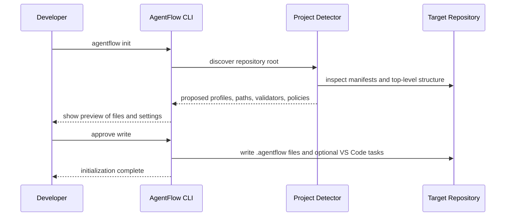

# Project Integration Model

## Layers

### AgentFlow product

Installed with `pipx install agentflow`. Owns:

- orchestration engine
- built-in defaults
- built-in prompts
- provider adapters
- validation and policy logic
- reusable templates

### Project integration

Written into each target repository by `agentflow init`. Owns:

- repository-specific rules and metadata
- validation commands
- path scopes
- prompt overrides
- task records
- optional VS Code task definitions

### Task records

Per-task state and evidence under `.agentflow/tasks/<task-id>`.

## Repository-local structure

```text
.agentflow/
├── config.yaml
├── project-context.md
├── architecture-rules.md
├── validation.yaml
├── policies/
│   ├── commands.yaml
│   └── paths.yaml
├── prompts/
│   ├── planner.md
│   └── implementer.md
└── tasks/
```

This structure is intentionally small. Only files that affect project behavior or retain task evidence are written into the target repository.

## Why these files exist

- `config.yaml`: project identity, paths, autonomy defaults, adapter defaults.
- `project-context.md`: human-maintained description of the repository and domain.
- `architecture-rules.md`: design constraints the planner and reviewer must enforce.
- `validation.yaml`: explicit deterministic validation pipeline.
- `policies/commands.yaml`: command allowlist and blocked patterns.
- `policies/paths.yaml`: editable, read-only, and forbidden path policies.
- `prompts/`: optional prompt overrides or extensions.
- `tasks/`: persisted per-task records.

## Configuration inheritance

Resolution order:

```text
built-in defaults
    ↓
user-level configuration
    ↓
project-level configuration
    ↓
task-level overrides
```

Rules:

- scalar values override from later layers
- list values use explicit merge semantics per setting
- prompt files can extend or replace built-ins
- every resolved setting records its origin

## `agentflow config show --resolved`

The command prints effective values and provenance.

Example output shape:

```yaml
validation.default_profile:
  value: python
  origin: project:.agentflow/config.yaml
autonomy.maximum_repair_iterations:
  value: 4
  origin: built-in
prompts.planner:
  value: .agentflow/prompts/planner.md
  origin: project override
```

## Repository detection and identity

### Root discovery

- Start from current working directory.
- Walk upward until a Git root is found.
- If nested repositories exist, prefer the nearest enclosing root unless user overrides it.

### Project identity

The project ID is derived from:

- canonical repository root path hash
- repository remote fingerprint when available
- local config UUID stored in `.agentflow/config.yaml`

This avoids state leakage between cloned repositories that share a name but not a filesystem root.

### Concurrent repositories

- repository-local files keep task state separated
- user-level SQLite stores a distinct project key per repository root
- worktree paths include project and task IDs

## `agentflow init`

`agentflow init` must:

1. verify the target is a Git repository
2. discover the root
3. inspect project manifests and top-level structure
4. detect likely stack and framework
5. propose source, test, docs, and infrastructure paths
6. propose validation commands
7. propose forbidden paths
8. show a preview before writing files
9. avoid overwriting without explicit approval
10. remain idempotent on repeat runs

### Initialization sequence



## Supported repository types in MVP

- Python and Django
- Node and TypeScript
- .NET
- Terraform and infra-only repositories
- mixed monorepos via path-scoped profiles

## What is not copied into target repositories

- AgentFlow internal architecture docs
- provider-specific implementation logic
- full built-in prompts unless overridden
- product test suite
