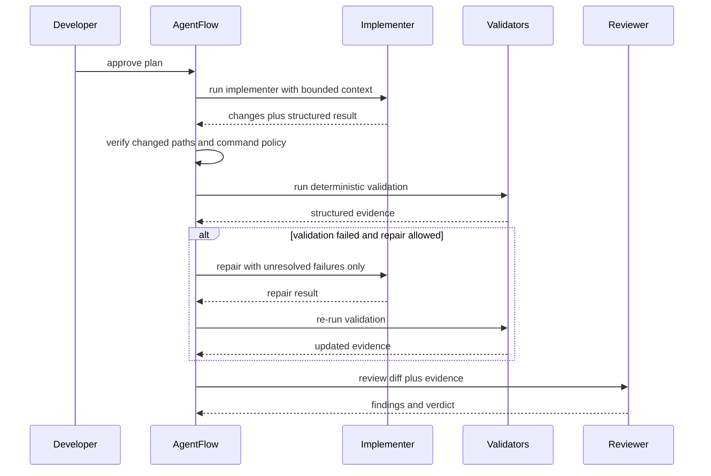

# Validation And Review Loop

## Principle

Deterministic validation runs before AI review. The reviewer should consume proof, not reconstruct it from a diff alone.

## Pipeline shape

Possible validators:

- formatting
- linting
- type checking
- unit tests
- integration tests
- coverage checks
- security scanning
- dependency checks
- migration checks
- schema checks
- changed-path validation
- forbidden-command validation
- secret scanning
- documentation checks
- Git cleanliness checks

## Validation result model

```yaml
validation:
  formatting:
    status: passed
  lint:
    status: passed
  type_check:
    status: passed
  tests:
    status: passed
    passed: 142
    failed: 0
  changed_path_policy:
    status: passed
```

Each result must store:

- validator ID
- status
- summary
- raw log path
- parsed metrics
- duration
- timeout flag
- input hash when useful

## Review and repair sequence



## Non-progress detection

Block the task when repair stops converging. Signals:

- stable failure hashes
- normalized failure signatures
- unchanged validation output
- unresolved blocking finding count not decreasing
- repeated command failures
- diff size growing without reducing blockers
- repeated agent summaries or repeated malformed output

## Repair context minimization

Repair iterations should receive only:

- unresolved relevant findings
- current diff summary
- failed validation evidence
- relevant plan section
- permitted file scope

Do not send the full task history on every iteration.

## Stop conditions

Mark task `blocked` when:

- maximum repair iterations reached
- same failure repeats without meaningful change
- findings are not decreasing
- out-of-scope files change
- tests regress
- validation evidence becomes inconsistent
- destructive or unexpected infrastructure change appears
- requirements remain ambiguous
- scope expansion is requested
- provider repeatedly fails
- a human approval gate is reached

## Reviewer schema expectations

Each finding includes:

- ID
- severity
- category
- title
- file and line when available
- description
- evidence
- required action
- status
- first-seen iteration
- last-seen iteration
- resolution evidence
- related acceptance criterion

## Finding identity strategy

Generate stable IDs from normalized issue attributes such as:

- category
- file path
- normalized title
- normalized evidence anchor
- related acceptance criterion

This enables cross-iteration tracking with some tolerance for line movement.
