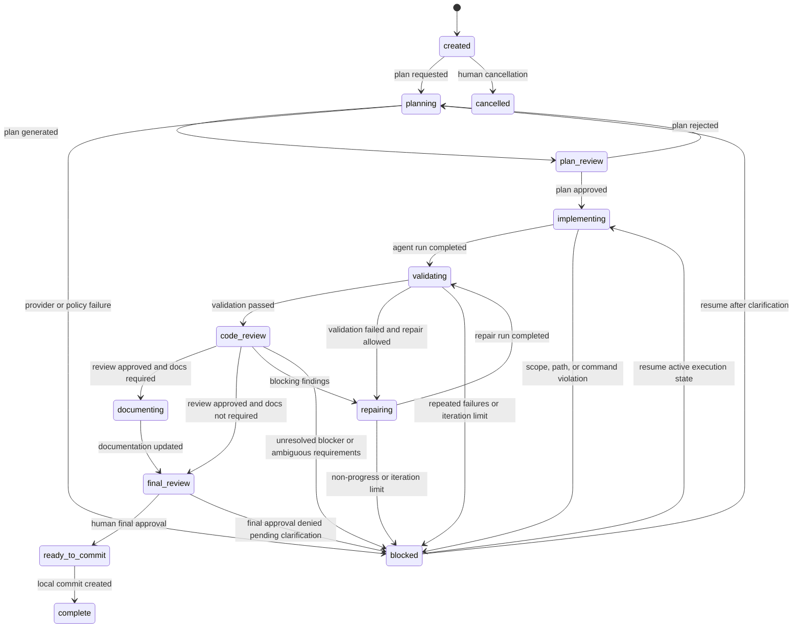
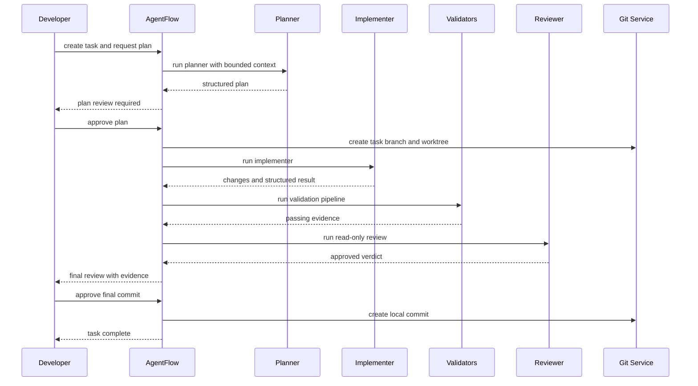

# Workflow State Machine

## States

- `created`
- `planning`
- `plan_review`
- `implementing`
- `validating`
- `repairing`
- `code_review`
- `documenting`
- `final_review`
- `ready_to_commit`
- `complete`
- `blocked`
- `cancelled`

## State ownership

Only the orchestration engine may change task state. Agents can suggest a next state, but suggestions are advisory and must be validated against current state, pending approvals, policy checks, and persisted evidence.

## State diagram

## Valid transitions

- `created -> planning`
- `planning -> plan_review`
- `plan_review -> planning`
- `plan_review -> implementing`
- `implementing -> validating`
- `validating -> code_review`
- `validating -> repairing`
- `repairing -> validating`
- `code_review -> repairing`
- `code_review -> documenting`
- `code_review -> final_review`
- `documenting -> final_review`
- `final_review -> ready_to_commit`
- `ready_to_commit -> complete`
- `* -> blocked` when an unrecoverable gated condition occurs
- `created|planning|plan_review|blocked -> cancelled` by human action

## Invalid transitions

Examples:

- `created -> implementing` without approved plan
- `implementing -> complete` without validation, review, and final approval
- `repairing -> complete` without returning through validation and review
- `blocked -> complete` without explicit resume and successful flow completion

## Automatic transitions

- `planning -> plan_review` after a plan passes schema validation
- `implementing -> validating` after an implementation run completes without policy violation
- `validating -> code_review` when required validators pass
- `validating -> repairing` when validators fail and repair is permitted

## Human approval transitions

- `plan_review -> implementing`
- `final_review -> ready_to_commit`
- any transition that expands scope or grants a new command approval
- any resume from `blocked` that changes effective configuration

## Preconditions

- every transition must record a causation event
- destination state must be allowed from current state
- required approvals must exist and be current
- relevant artifacts must be persisted before the transition
- pending command approvals must be resolved before continuing execution

## Persisted transition event

Each state change event stores:

- previous state
- resulting state
- triggering action
- actor
- correlation ID
- related run ID
- reason summary
- machine-readable payload

## Recovery behavior

On resume:

1. load snapshot state
2. reconcile it against event log and run records
3. detect incomplete operations
4. mark interrupted run records as failed or unknown
5. return to the last safe state boundary
6. require human approval if ambiguity remains

## Successful task sequence

## Idempotency requirements

- repeated `approve-plan` should not duplicate state changes
- repeated `validate` with unchanged inputs may reuse prior evidence hash
- repeated `resume` must not duplicate events for the same recovery action
- `complete` can only happen once per task

## Permitted actions by state

- `created`: edit requirements, request plan, cancel
- `planning`: inspect repo, run planner, block, cancel
- `plan_review`: approve or reject plan
- `implementing`: run bounded implementer, request approvals, block
- `validating`: execute validators, persist evidence
- `repairing`: run bounded repair iteration
- `code_review`: run reviewer, inspect findings
- `documenting`: run documentation update
- `final_review`: inspect final diff and evidence, approve or block
- `ready_to_commit`: create final local commit
- `blocked`: inspect cause, resume, cancel
- `complete`: inspect artifacts, archive
